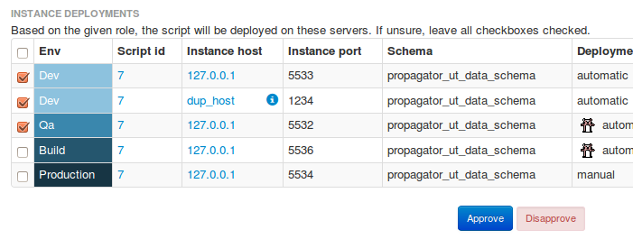
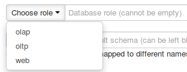
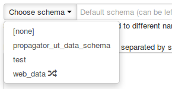
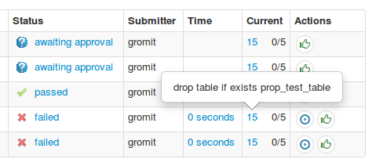
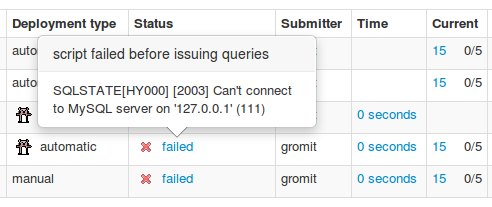
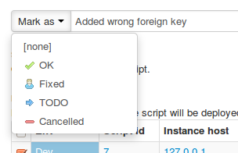
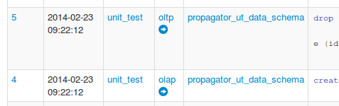
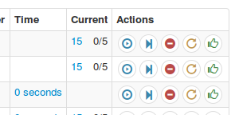

## Manual

### About

**Propagator** is a schema & data deployment tool that works on a multi-everything topology: 

  * Multi-server: push your schema & data changes to multiple instances in parallel
  * Multi-role: different servers have different schemas
  * Multi-environment: recognizes the differences between development, QA, build & production servers
  * Multi-technology: supports MySQL, Hive (Cassandra on the TODO list)
  * Multi-user: allows users authenticated and audited access
  * Multi-planetary: TODO
It makes for a centralized deployment control, allowing for tracking, auditing
and management of deployed scripts.

It answers such questions as "Who added column 'x' to table 't' and when?",
"Was that column added to the build & test servers?"; "It's not there; was
there a failure? What was the failure?". It provides with: "OK, let's deploy
it on all machines"; "There was some error and it's fixed now. Let's deploy
again on this paritular instance"; "We already deployed this manually; so
let's just mark it as 'deployed'".

_Propagator_ is developed at [Outbrain](http://www.outbrain.com) to answer for
the difficulty in managing schema changes made by dozens of developers on a
multi-everything topology in continuous delivery.

_Propagator_ is released as open source under the [Apache 2.0
license](http://www.apache.org/licenses/LICENSE-2.0).

Developed by Shlomi Noach.



### Download

_Propagator_ is released as open source and is available at:
<https://github.com/outbrain/propagator>

### Install

_Propagator_ is a PHP web app, running on top of Apache and uses MySQL as
backend.

_Propagator_ is developed and tested on Linux (Ubuntu 12.10 & CentOs 5.9). It
will likely run well under BSD and Mac OS/X, and possibly on Windows.

##### Requirements

  * Apache 2
  * php >= 5.3
  * MySQL >= 5.0
  * php modules: php5-mysql. If you wish to fork/develop _Propagator_, install phpunit.
  * Optional: to view instance topologies (see Advanced DBA actions), install [Percona Toolkit](http://www.percona.com/software/percona-toolkit)
Copy the entire _Propagator_ tree under your Apache html directory (e.g.
`/var/www/html/propagator/`)

_Propagator_ uses MySQL as backend, where all metadata about your system and
topologies is read from (see Populate section) and where all deployments,
history and status are written. Use the provided `install.sql` file to
generate the schema and tables. By default, the schema name is `propagator`.

Sample installation method:

    
    
    bash$ mysql -uroot -psecr3t < install.sql 
    

Next, you must tell _Propagator_ where the MySQL database backend is, and
provide with credentials. Update the `conf/config.inc.php` file in the like of
the following:

    
    
    $conf['db'] = array(
      'host'	=> '127.0.0.1',
      'port'	=> 3306,
      'db'	=> 'propagator',
      'user'	=> 'the_user',
      'password' => 'the_password'
    );

##### Upgrade

_Propagator_ is evolving, and further development requires schema changes.
These are provided as "patches" to the original schema.

In case you are upgrading from a previous installed version, follow on to
install any `install-db-migration-*` file that is later than your
installation. If you're unsure, simply execute any `install-db-migration-*`
file (ordered by name/timestamp) - and ignore any errors. You can do so via
the following example:

    
    
    bash$ mysql -uroot -psecr3t --force propagator < install-db-migration-2014-03-24.sql
    

Finally, you will need to populate your database. Read on to understand the
Concepts, then follow the instructions under the Populate section.

### Concepts: instances, environments, roles & scripts

##### Instances

Your database _instances_ are where you will be deploying your scripts to.
These would be MySQL or Hive instances (more types of databases will be
supported in the future). If you are familiar with MySQL replication, then
please note only masters are relevant to _Propagator_, since changes applied
to masters will propagate to slaves via normal MySQL replication.

An instance is identified by hostname & port. Thus, you can manage multiple
instances running on the same machine.

##### Environments

Not all instances are created the same. Some are production servers, some are
build servers, some QA/Testing and some are just development databases.

Instances are categorized by the following environments: `production`,
`build`, `qa`, `dev`. It is up to you to properly categorize your instances.

_Propagator_ can treat different environments in different ways. For example,
by default deployments will never execute automatically on production
instances and will require a manual user action. This is configurable in
`conf/config.inc.php`:

    
    
    $conf['instance_type_deployment'] = array(
        'production' 	=> 'manual',
        'build' 		=> 'automatic',
        'qa' 			=> 'automatic',
        'dev' 			=> 'automatic'
    );

##### Roles

You may have completely different databases. For example, you might have one
"major" MySQL OLTP server (along with a bunch of slaves), and a different
MySQL server for OLAP queries, which you load hourly/daily. Yet other MySQL
instances may be used for company internals, and you access your Hadoop
cluster via Hive.

In the above, the different servers are likely to have completely different
schema and functionality. This is where **roles** come in: they are your way
of categorizing your databases based on functionality.

And yet, multiple instances can be associated with a single role. The most
obvious example is that your test servers will have identical schema to your
production servers, in which case they are sharing the same role. Moreover,
your test or build servers are likely to only contain a small amount of data,
and so they can accommodate multiple functions. And so the instance-role
mapping is a many-to-many association.

##### Scripts

A script is a set of queries you wish to deploy (propagate) on your instances.
This could be a `CREATE TABLE...`, an `INSERT INTO` command etc. A script can
be composed of multiple queries. See Propagate section for more on this.

### Populate database

Post-install _Propagator_, you must populate some tables which describe your
databases layout.

##### Essential

`database_instance`: this is the listing of all database instances you will
wish to deploy scripts on. This excludes any replica slaves (since they are
merely replaying changes on their masters).

    
    
    desc database_instance;
    +----------------------+---------------------------------------+------+-----+------------+----------------+
    | Field                | Type                                  | Null | Key | Default    | Extra          |
    +----------------------+---------------------------------------+------+-----+------------+----------------+
    | database_instance_id | int(10) unsigned                      | NO   | PRI | NULL       | auto_increment |
    | host                 | varchar(128)                          | NO   | MUL | NULL       |                |
    | port                 | smallint(5) unsigned                  | NO   |     | NULL       |                |
    | environment          | enum('production','build','qa','dev') | NO   | MUL | production |                |
    | description          | varchar(255)                          | NO   |     |            |                |
    | is_active            | tinyint(3) unsigned                   | NO   |     | 0          |                |
    | is_guinea_pig        | tinyint(3) unsigned                   | NO   |     | 0          |                |
    +----------------------+---------------------------------------+------+-----+------------+----------------+
    

Provide data as follows:

  * host: host name or IP for your database instance
  * port: public TCP/IP port database listens on (typically `3306` for MySQL)
  * environment: see Concepts
  * description: make it meaningful. It's for you and your peers
  * is_active: unused at this stage
  * is_guinea_pig: "1" if this instance should serve as guinea pig. Guinea pigs are those instances that are deployed first, and at least one guinea pig must deploy successfully for other instances to be deployed. See Deploy

`database_role`: listing of roles.

    
    
    desc database_role;
    +------------------+----------------------+------+-----+---------+-------+
    | Field            | Type                 | Null | Key | Default | Extra |
    +------------------+----------------------+------+-----+---------+-------+
    | database_role_id | varchar(32)          | NO   | PRI | NULL    |       |
    | database_type    | enum('mysql','hive') | NO   |     | mysql   |       |
    | description      | varchar(1024)        | YES  |     | NULL    |       |
    | is_default       | tinyint(3) unsigned  | YES  |     | 0       |       |
    +------------------+----------------------+------+-----+---------+-------+
    

Provide data as follows:

  * database_role_id: a short, meaningful name for your role; this serves as the role's ID. Examples: `'oltp'`, `'dwh'`
  * database_type: currently only 'mysql' and 'hive' are supported
  * description: make it meaningful. It's for you and your peers
  * is_default: make just one role a default one (though no harm done if you define none or multiple). The default role is auto-selected on the script deployment page. 

`database_instance_role`: associate instances with roles

    
    
    desc database_instance_role;
    +----------------------+------------------+------+-----+---------+-------+
    | Field                | Type             | Null | Key | Default | Extra |
    +----------------------+------------------+------+-----+---------+-------+
    | database_instance_id | int(10) unsigned | NO   | PRI | NULL    |       |
    | database_role_id     | varchar(32)      | NO   | PRI | NULL    |       |
    +----------------------+------------------+------+-----+---------+-------+
    

_Propagator_ does not provide with CRUD functionality. Populating these tables
is on you; use your favorite MySQL GUI or command line.

##### Optional

`general_query_mapping`: auto-transformation of queries executed on any
instance (see Mappings).

    
    
    desc general_query_mapping;
    +--------------------------+------------------+------+-----+---------+----------------+
    | Field                    | Type             | Null | Key | Default | Extra          |
    +--------------------------+------------------+------+-----+---------+----------------+
    | general_query_mapping_id | int(10) unsigned | NO   | PRI | NULL    | auto_increment |
    | mapping_type             | varchar(32)      | YES  |     | NULL    |                |
    | mapping_key              | varchar(4096)    | YES  |     | NULL    |                |
    | mapping_value            | varchar(4096)    | NO   |     | NULL    |                |
    +--------------------------+------------------+------+-----+---------+----------------+
    

Provide data as follows:

  * mapping_type: Currently supported values are `regex` and `federated`
  * mapping_key: relevant on `regex` only: pattern to match replace
  * mapping_value: on `regex`: replacement text. On `federated`: format of `CONNECTION` clause. 

`database_role_query_mapping`: auto-transformation of queries executed on any
instance associated with specific roles (see Mappings).

    
    
    desc database_role_query_mapping;
    +--------------------------------+------------------+------+-----+---------+----------------+
    | Field                          | Type             | Null | Key | Default | Extra          |
    +--------------------------------+------------------+------+-----+---------+----------------+
    | database_role_query_mapping_id | int(10) unsigned | NO   | PRI | NULL    | auto_increment |
    | database_role_id               | varchar(32)      | NO   | MUL | NULL    |                |
    | mapping_type                   | varchar(32)      | YES  |     | NULL    |                |
    | mapping_key                    | varchar(4096)    | YES  |     | NULL    |                |
    | mapping_value                  | varchar(4096)    | NO   |     | NULL    |                |
    +--------------------------------+------------------+------+-----+---------+----------------+
    

Provide data as follows:

  * database_role_id: role for which this mapping applies
Other columns same as for `general_query_mapping`.

`database_role_query_mapping`: auto-transformation of queries executed on
specific instances (see Mappings).

    
    
    desc database_instance_query_mapping;
    +------------------------------------+------------------+------+-----+---------+----------------+
    | Field                              | Type             | Null | Key | Default | Extra          |
    +------------------------------------+------------------+------+-----+---------+----------------+
    | database_instance_query_mapping_id | int(10) unsigned | NO   | PRI | NULL    | auto_increment |
    | database_instance_id               | int(10) unsigned | NO   | MUL | NULL    |                |
    | mapping_type                       | varchar(32)      | YES  |     | NULL    |                |
    | mapping_key                        | varchar(4096)    | YES  |     | NULL    |                |
    | mapping_value                      | varchar(4096)    | NO   |     | NULL    |                |
    +------------------------------------+------------------+------+-----+---------+----------------+
    

Provide data as follows:

  * database_instance_id: instance for which this mapping applies
Other columns same as for `general_query_mapping`.

`database_instance_schema_mapping`: auto-transformation of schema names
executed on specific instances (see Mappings).

    
    
    desc database_instance_schema_mapping;
    +-------------------------------------+------------------+------+-----+---------+----------------+
    | Field                               | Type             | Null | Key | Default | Extra          |
    +-------------------------------------+------------------+------+-----+---------+----------------+
    | database_instance_schema_mapping_id | int(10) unsigned | NO   | PRI | NULL    | auto_increment |
    | database_instance_id                | int(10) unsigned | NO   | MUL | NULL    |                |
    | from_schema                         | varchar(64)      | NO   | MUL | NULL    |                |
    | to_schema                           | varchar(64)      | NO   |     | NULL    |                |
    +-------------------------------------+------------------+------+-----+---------+----------------+
    

Provide data as follows:

  * database_instance_id: instance for which this mapping applies
  * from_schema: name of schema to replace
  * to_schema: replacement schema name. May contains '%' wildcards

You may map the same `from_schema` into multiple `to_schema` values on the
same instance, in which case a deployment on such instance will execute
multiple times, on multiple schemas.

Wildcard mapping is also supported. `to_schema` may take the form of `my_wp_%`
which will match any schema name `LIKE 'my_wp_%'` (do note that '_' is in
itself a wildcard. _Propagator_ only considers a mapping to be a "wildcard"
mapping if it contains the '%' sign).

Wildcard mapping requires that _Propagator_ pre-connects to relevant instance
before deployment, to gather those schema names that match the wildcard.

`known_deploy_schema`: listing of schema names that are presented to the user:

    
    
    desc known_deploy_schema;
    +------------------------+---------------------+------+-----+---------+----------------+
    | Field                  | Type                | Null | Key | Default | Extra          |
    +------------------------+---------------------+------+-----+---------+----------------+
    | known_deploy_schema_id | int(10) unsigned    | NO   | PRI | NULL    | auto_increment |
    | schema_name            | varchar(64)         | NO   | MUL | NULL    |                |
    | is_default             | tinyint(3) unsigned | YES  |     | 0       |                |
    +------------------------+---------------------+------+-----+---------+----------------+
    

Provide data as follows:

  * schema_name: name of schema (aka database in MySQL jargon)
  * is_default: make just one schema a default one (though no harm done if you define none or multiple). The default schema is auto-selected on the script deployment page. 
Data in this table has no functional effect other than providing the user with
possible schemas the user may wish to deploy a script on.

### Propagate scripts





This is the place to start actual usage of _Propagator_!

Click the **Propagate Script** link on the top navigation bar to
deploy/propagate a new script. A script is a set of one or more queries to be
executed, and the **Propagate Script** submission page allows you to describe
what to deploy where. You will need to fill in the following:

  * Role: you must pick from existing set of roles (see Concepts-Roles). This will in effect determine which instances will be deployed with your script. 
  * Schema: you can fill this freely, though you have a pre-defined list of possible schemas via the `known_deploy_schema` (see Populate-Optional).   
_Propagator_ encourages you to _not_ specify schema name in your script
queries, but instead specify the schema separately, and issue schema-less
queries. For example, you are encouraged _not_ to use `ALTER TABLE
sakila.actor ...` but instead specify `sakila` as the script's schema, then
enter `ALTER TABLE actor ...` in script.  
The above is not enforced and you are free to do as you please. However note
the benefits of specifying the schema externally:

    * Queries become generalized
    * _Propagator_ will connect to your instances using the specific schema name: this may have beneficial security implications
    * _Propagator_ supports the notion of schema mapping: that the same conceptual schema is called differently on different instances. Based on the `database_instance_schema_mapping` your script will be deployed differently, and automatically so, on different instances. 
  * Script: a set of one or more queries to issue. These could be DDL (`CREATE`, `ALTER`, `DROP` etc.) or DML (`INSERT`, `DELETE`, `CALL` etc.). (It may also be `SELECT` queries, though _Propagator_ will not return any result set from such queries)   
_Propagator_ discourages issuing the same exact script more than once and
warns in such case. It is however allowed.  
Your script's queries might be modified when executed. This is controlled by
Mappings. For example, you may wish to transform any `CREATE TRIGGER`
statement to `CREATE DEFINER='root'@'localhost' TRIGGER`.

  * Description: make it meaningful. It's for you and your peers.
You will notice that the Roel and Schema you have entered will be used in the
next time you submit a script as auto-suggested value. This is to save you
some time and errors, and follows the pattern that specific users typically
deploy on same whereabouts of the database.

### Deploy & manage script

Once you've submitted your script for deployment, you are directed at the
view-script page. This is where you approve specific or all instances for
deployment; follow up on deployment status; take action if needed; comment for
the benefit of your peers.

A quick breakdown of the page:

  * General script info at the top 
  * Followed by comment area (use it!) 
  * A query-breakdown of the script is initially hidden (visibility can be toggled) 
  * Script deployment status table -- this is where most of the fun things happen 
  * Additional actions at the bottom 

##### Approving

You've submitted a script. The script was associated with a role. Based on
that role, _Propagator_ chose a set of instances where the script would be
deployed to.

It is now at your hands to deploy the script onto those instances. You may
choose to deploy it on all instances (which makes sense, they all belong to
that role), or you may wish to only deploy onto **Dev** and **QA** environment
at first, and only later come back and deploy on to **Build** and
**Production** environments.

You will need to **Approve** the relevant instances. You might actually want
to skip a specific instance for whatever reason, in which case you may
**Disapprove** it. Disapproved instances can later be Approved again.

Don't leave instances in unknown approval state for a long time. Either
**Approve** an instance or **Disapprove** it. Otherwise, one week later, no
one knows _why_ those specific instances were not deployed. Was there a
specific reason? Did the user just forget about them? By Disapproving an
instance you're making a clear point that it should not be deployed to.

##### Status





This is the place where you can hopefully sit back, smile and relax, as your
script is being deployed on approved instances. Alternatively, you can be at
your keyboard and mouse, smile and relax as you control and diagnose
deployment problems.

One an instance is approved, deployment should start automatically. Do
remember that by default `production` instances are not auto-deployed. This is
for safety measures -- double verification that that `ALTER TABLE` should
indeed be carried away by _Propagator_ (or you might choose to do an [online
operation](http://openarkkit.googlecode.com/svn/trunk/openarkkit/doc/html/oak-
online-alter-table.html) yourself). For such `production` instances, you will
need to click the **Run/Retry** button to the right.

Whether automatic or manual, once deployment begins, the status table makes
for a self-updating dashboard. It will refresh periodically and present you
with deployment status for all instances.

You will notice that **Guinea pig** instances are deployed first. If any
instacnes are at all defined as **Guinea pig**, _Propagator_ uses them as ...
guinea pigs, and only once the script is successfully deployed on at least one
guinea pig, does _Propagator_ continue to deploy the script onto the rest of
the instances. It is encouraged that you do define at least once instance per
environment as **Guinea pig**. See Populate - Essential for more.

While a script is being deployed, and assuming it does not complete
immediately, you are able to track its status: watch the runtime, current
query and overall progress on a per-instance basis.

Informative messages are available almost everywhere. Click the **Current**
query text to reveal the query that is being executed right now. Click the
**time** entry link to get complete start-to-end timing.

The **Status** message is the most important thing to watch. Hopefully the
script will deploy successfully, whereas you will get a "passed" confirmation.
In case the script fails, you will see a "failed" message. Click the "failed"
message to find out why: is it a credentials thing? A duplicate key? Other
problem? The status message is always clickable.

The **Mark as Passed** button ("thumb up") marks the script as successful.
Maybe you issued the query yourself manually beforehand, in which case
_Propagator_ may fail to deploy (e.g. "table already exists"). If you are
certain the very same script has been fully deployed (all script queries
executed or otherwise applied) use this action to override _Propagator_'s
failure or inability to deploy.

See also Advanced DBA actions for deployment actions that can override or
resolve script deployment issues.

##### Commenting



Adding a short comment is possible and encouraged, especial in the case where
the script had trouble deploying. The comment can be associated with a "OK",
"Fixed", "TODO", "Cancelled" label/icon.

Submitted comments show up on the script's viewing page (same page where
comment was submitted), as well as on the scripts history page. This allows a
supervisor or a guest to easily gather information about script history; what
went wrong; what was done; etc.

##### Additional actions

At bottom tabs, the following actions are made available:

  * Propagate New: submit a new script identical to current one. This will land you on the **Propagate script** This is useful, for example, when you are mistakenly introducing syntax errors to your script. You realize it only upon deployment. Editing a scirpt in place is strictly and intentionally impossible in _Propagator_, but you are given the option of submitting a new script in the likes of the old one. 
  * Redeploy: a little bit tricky situation is when you add new instances to _Propagator_, that are not up to date with other instances (perhaps by the time you backed-up an instance and deplicated it onto another, some deployments were made). The **Redeploy** action simply adds to this deployment those hosts that were not previously there. It is then up to you to **Approve** them. 

### Reviewing script history



You can search, filter and view scripts history.

A user's own history is available via **Welcome** -> **My history**. If
`history_visible_to_all` is set (see Users & privileges), then any user can
also browse history for all submitted scripts, not just his own. Complete
history is available via **Welcome** -> **Script history**.

Search is available via **Find script** in top navigation bar. Type some text
to search for in script code, description, role or submitter name.

Script listing table allows paging and basic filtering: by same role as a
given script, same submitter, same schema.

Script description is followed by comments, if available.

The script listing also provides a quick summary of script status. Remember
that a script is deployed on multiple instances. The listing indicates how
many instances have been deployed successfully, how many have failed, and how
many instances in total for this deployment.

### Credentials

_Propagator_ deploys queries on remote databases. For this, it needs to get
credentials on those servers. At this stage there are two ways by which such
credentials can be provided.

##### Authentication

At this stage, _Propagator_ identifies users via `"PHP_AUTH_USER"`; this can
be provided by Apache's **.htaccess**, by connecting to **ldap** server etc.

In such case as the above, it is up to you to set Apache authentication.
_Propagator_ will simply expect a valid entry.

Otherwise, you can edit `conf/config.inc.php` to read:

    
    
    $conf['default_login'] = 'gromit';

In which case, any unidentified user is automatically mapped to `gromit`. If
you're doing a one man show as DBA/developer this might be simplest.

##### Users & privileges

All users are not equal. There are _normal_ users, and there are _DBAs_. DBA
users have greater privileges and broader set of actions (see Advanced DBA
actions).

To define who exactly accounts as DBA, edit `conf/config.inc.php` to read:

    
    
    $conf['dbas'] = array('gromit', 'penguin');

In the above, the `gromit` and `penguin` accounts are automatically considered
to be DBAs (there is no action required for those users, nor special
credentials).

You will obviously want to have at least one account that is a DBA.

Are scripts submitted by Alice visible to Trudy? Edit `conf/config.inc.php` to
read:

    
    
    $conf['history_visible_to_all'] = true;

When true, Trudy can see the entire history and search it, as well as seeing
details for all scripts deployed by other users. DBA users have this privilege
implicitly.

##### Two phase approval

Enhanced control can be set via `conf/config.inc.php`:

    
    
    $conf['two_step_approval_environments'] = array(
      'production', 
      'build'
    );
    

In the above, any deployment to the two environments `production`, `build`
must be manually approved by a DBA. Even after the normal user approves a
deployment, it hangs until the second approval is submitted.

### Credentials

_Propagator_ deploys queries on remote databases. For this, it needs to get
credentials on those servers. At this stage there are two ways by which such
credentials can be provided.

##### Session

The users can provide database credentials to _Propagator_. Credentials will
only be stored in the user's session, and never be written to file. Click
**Welcome** -> **Set credentials** to enter your credentials, and **Welcome**
-> **Clear credentials** to forcibly erase them from session memory.

_Propagator_ will let you know if your credentials are required. When entering
your credentials, _Propagator_ will verify them against one chosen instance.

This method requires that all users have database credentials. They will have
to have credentials that apply to all databases affected by a deployment they
are issuing. Either this would be a single credential that applies to all
instances (in which case this is some super-master account; all databases have
this account) or they would have to enter and re-enter different credentials
and deploy a script again and again, each time with different credentials
until all instances are covered.

##### Persistent

In this method the users have no knowledge of credentials, and _Propagator_
manages them all. For this to happen, you will need to provide _Propagator_
with plaintext passwords for each instance. (each instance may have different
credentials).

**WARNING**: make sure you understand the implications of storing plaintext passwords in file. 

To set up credentials, edit `conf/config.inc.php` to include an external
config file where these credentials are found. For example, add:

    
    
    include "/etc/propagator-credentials.conf.php";

Included file would have an entry such as follows:

    
    
    $conf['instance_credentials'] = array(
    "my.host01.name:3306" => "prop_user:super_duper_password_01",
    "my.host02.name:3306" => "prop_user:super_duper_password_02",
    "other.host.name:3306" => "prop_user:super_duper_password_99",
    );
    

Reason for including an external file is that it can be placed in a more
restricted directory, with stricter access (e.g. `chown apache:root ...`,
`chmod 600 ...`).


##### Notes

When working in persistent-credentials mode _Propagator_ simply assumes all
credentials are fine. It will not verify credentials against any host. In the
case one of the credentials is wrong, it will take a failed deployment to
reveal the problem. Do note that once the correct credentials are updated
_Propagator_ automatically picks them up and the submitter of a script may re-
run the failed deployment.

As consequence of the above, when working in persistent-credentials mode,
_Propagator_ will not issue a "credentials required" message at any stage.

Still in persistent-credentials mode, the user is still allowed to enter
credentials via **Welcome** -> **Set credentials**. In such case, the user's
credentials override the persistent credentials. This comes handy as you would
typically limit the privileges for the persistent credentials (do you really
have to have `SUPER` or `RELOAD` MySQL privileges for automated deployments?).
Nevertheless a DBA with super-user privileges may set her privileges in
session, and gain more power over deployments.

A configuration variable controls whether normal users are indeed allowed to enter their own credentials
(this is the default). One may disallow this, and only permit DBAs to enter their own credentials.
Edit `conf/config.inc.php` to read:

    $conf['restrict_credentials_input_to_dbas'] = true;

### Advanced DBA actions



The following actions are available to users recognized as DBAs:

##### Script deployment

On script-deployment page, the DBA is able to perform several actions per
instance-deployment entry:

  * Run/retry: same as for a normal user. _Propagator_ attempts to resume the script from the last failed position, or just run it completely if it hasn't even started. 
  * Run Next Query: execute a single query from the script, and pause immediately after. If the script hasn't been started yet then the first query is executed; otherwise the query indicated by the **Current** column. 
  * Skip One Query: ignore the **Current** query and point to the next one. NOTE: you will be, umm, _skipping a query_. But that's why you are the DBA! 
  * Restart Deployment: completely restart the script and run it from the beginning. This could come in handy if you made some manual fixes to the database which would allow it to execute after first failing. 

##### CRUD operations

Full CRUD operation are not supported. You need to provide _Propagator_'s
backend data using your favorite MySQL GUI tool or via commandline.

However, _Propagator_ does support a limited set of operations that will make
your data maintenance safer:

  * Duplicate instance: on a database-instance page, bottom tabs, you may create a new instance based on current instance's data. In particular, the new instance will use same environment, same roles and same mappings as current instance.   
For example, you might have a couple build servers and you are adding a third
one. They should probably be set up almost identically.

  * Rewire instance: on a database-instance page, bottom tabs, you may associate new roles to an instance; disassociate existing roles. 
  * Duplicate role: on a database-role page, bottom tabs, you may create a new role based on current role's data. In particular, the new role will use same type, same instances and same mappings as current role. 
  * Rewire role: on a database-role page, bottom tabs, you may associate new instances to a role; disassociate existing instances. 

##### Replication topology

_Propagator_ manages master servers only, as slave instances are assumed to
get updates from their masters. As a utility service, and unrelated to
_Propagator_'s job, it allows you to see the replication topology for MySQL
instances.

This is done by invoking [pt-slave-find](http://www.percona.com/doc/percona-
toolkit/2.2/pt-slave-find.html), a Perl tool being part of Percona Toolkit.
You must have **pt-slave-find** installed and available on the same host where
your PHP/Apache executes.

Note that **pt-slave-find** requires special credentials such as `REPLICATION
CLIENT`. It is suggested that you provide _Propagator_ with super-user
privileges through session credentials.

The output from **pt-slave-find** is a tree-listing of host names, and it can
be prettified. Edit `conf/config.inc.php`, and add regular expressions to
match host names. Host names will be assigned different colors per different
matching expressions. For example, you might color hosts differently based on
the data center they're located in:

    
    
    $conf['instance_topology_pattern_colorify'] = array (
    "/[.]east/",
    "/[.]west/",
    "/localhost/"
    );
    

### Mappings

_Propagator_ supports mapping, or transformations of your queries before
deploying on your database instances.

Click the **Mappings** link at the top navigation bar to see setup for all
mappings.

##### Schema

The same conceptual schema may be named differently on different instances.
For example, your production `webapp` schema may be named `unittest_webapp` on
your test server.

Based on the `database_instance_schema_mapping` table data, your script will
be deployed differently, and automatically so, on different instances.

You may map a schema name into multiple schemas matching some wildcard. This
is useful if you have multiple similar schemas on the same database instance,
all which have the same set of tables, all which should be affected by the
same deployment. See Populate Database - Optional for more on this.

If you don't have any such cases where your schemas can be named differently
on different servers, you can safely ignore this feature.

##### Query

You may have automatic query transformation for propagated scripts. Such
transformations can be defined for all queries (via the
`general_query_mapping` table), for queries executing on a specific role (via
the `database_role_query_mapping` table), or for queries executing against
specific instances (via the `database_instance_query_mapping` table).

Two types of query transformations are supported at this time:

  * federated: transforming creation of `FEDERATED` tables such that user, password, host, port & schema (or subset of the above) are applied differently on different instances.   
An example can be:

    
	    select * from database_instance_query_mapping;
	    +----------------------+--------------+-------------+-------------------------+
	    | database_instance_id | mapping_type | mapping_key | mapping_value           |
	    +----------------------+--------------+-------------+-------------------------+
	    |                    9 | federated    | NULL        | localhost:3306/myschema |
	    +----------------------+--------------+-------------+-------------------------+
    

	If your script includes, foe example, a `CREATE TABLE ... ENGINE=FEDERATED
	CONNECTION='super:duper@someserver:3307/'` query, the query is transformed to
	`CREATE TABLE ... ENGINE=FEDERATED
	CONNECTION='super:duper@localhost:3306/myschema'` for the specific instance
	specified (`database_instance_id` = 9).

  * regex: a simple regular expression search and replace mechanism. Since _Propagator_ is a PHP application, you must provide the regular expression in PHP format. For example, the following: 
    
        select * from database_instance_query_mapping;
        +----------------------+--------------+-----------------------+-------------------------------------------+
        | database_instance_id | mapping_type | mapping_key           | mapping_value                             |
        +----------------------+--------------+-----------------------+-------------------------------------------+
        |                    9 | regex        | /CREATE[\s]+TRIGGER/i | CREATE DEFINER='root'@'localhost' TRIGGER |
        +----------------------+--------------+-----------------------+-------------------------------------------+
    
	
	Will implant the `DEFINER` clause within a `CREATE TRIGGER` statement in case
	the user forgets to specify it. The above example applies only to a single
	instance (`database_instance_id` = 9)  


Similarly, one can specify a query mapping for an entire role:

    
    select * from database_role_query_mapping;
    +------------------+--------------+-------------+---------------+
    | database_role_id | mapping_type | mapping_key | mapping_value |
    +------------------+--------------+-------------+---------------+
    | hive             | regex        | /^(#.+)\n/  |               |
    +------------------+--------------+-------------+---------------+
    

In the above, all scripts issued against instances of the `Hive` role, are
stripped of commented lines (which the connector dislikes and will not
accept).

##### Event Listeners

You can add listeners to propagator that will be called/activated when
a certain hook/event occurs. With this feature, you can notify other
tools and/or logs of when propagator scripts are created, deployed, etc...

The following is an example of what a listener might look like. In this listener,
we are simply writing to a log file when our event occurs.

```php
<?php
require_once "EventListenerInterface.php";

class MyListener implements EventListenerInterface {
  
  public function update ($event) {
    file_put_contents("/tmp/listener_log.log", $event->name, FILE_APPEND);
  }
  
}

?>
```

The listener's update method will be pass an `Event` object that will describe the event
that has just occurred. Each `Event` object will have the following properties. Not all
properties will have a value for every event. It is dependant on whether or not that information
was available/applicable to the event.

| Property | Description |
| -------- | ----------- |
| name     | The name of the event that just occurred (see table below) |
| script_id | The unique id of the propagator script that is related to the event |
| role      | The role related to the event |
| schema    | The schema related to the event |
| user      | The user that performed the action related to the event |
| description | The description of the propagator script that is related to the event |
| comment     | The comment left on the propagator script that is related to the event (only for comment_script events|
| comment_mark | The mark left on the comment on the propagator script that is related to the event (only for comment_script events) |
| instances    | An associative array of each environment that was affected by the event. Each instance in the array can have the following keys that further describe the status of the environment after the event has occurred: "environment", "deployment_status", "marked_status", "deployment_type", "processing_start_time", "processing_end_time", "last_message" |


Listeners live in the listeners directory that is apart of propagator's file tree. Or
you can change the location of the listeners directory by changing the value of 
`$conf['event_listener_dir']`. To register your listener, you will need to add it 
to `conf/config.inc.php` under `$conf['event_listeners']`. A listener can be 
registered for multiple events or just one. Below are examples of a listener 
registered for multiple events followed by a listener registered for just one.

    $conf['event_listeners'] = array (
      array(
        'event' => array('new_script', 'approve_script'),
        'file'  => "MyListener.php",
        'class' => "MyListener",
      ),
      array(
        'event' => "execute_script",
        'file'  => "MyListenerExecute.php",
        'class' => "MyListenerExecute",
      )
    );

Below is a list of potential events/hooks you can register for and a short
description of what is happening in that particular event

| Event Name        | Description                                                                        |
| ----------------- | ---------------------------------------------------------------------------------- |
| new_script        | Someone has created a new propagator script                                        |
| redeploy_script   | Someone has redeployed a propagator script                                         |
| approve_script    | Someone has approved a propagator script                                           |
| disapprove_script | Someone has disapproved a propagatorscript                                         |
| execute_script    | Someone has executed a propagator script in an environment                         |
| mark_script       | Someone has manually marked a propagator script for a certain environment          |
| skip_script       | Someone has elected to skip a propagator script executing in a certain environment |
| comment_script    | Someone has left a comment on a propagator script                                  |
